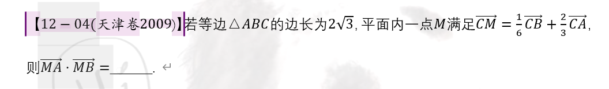

（标准的教室布局，唐僧站在黑板旁，悟空，八戒，沙僧，小白龙2X2坐在下方）。

（接下来每个人说话的时候最好都是特写，对话的时候双方都展示出来更好，表情能够和对话配合么？）

唐僧：徒儿们，为师今天传授给你们一个新的“佛法”，让你们在向量的辩法中，能够大杀四方！（特写：唐僧站在黑板边上）

八戒：师傅，快别墨迹了，有什么手段你就使出来吧！（特写：八戒坐在座位上嘟嘟囔囔的说着）

唐僧：你这呆子，可没见过你如此好学！（唐僧指着八戒）

悟空：据说嫦娥仙子要参加此次斗法，呆子想大出风头呢！（悟空经典动作）

八戒：猴哥，你看你（八戒经典动作）

唐僧：你这呆子，我就说你怎突然有如此觉悟，阿弥陀佛，

唐僧刚要念叨下去时。。。

小白龙：师傅，快教我们上乘佛法吧！

唐僧：好吧，徒儿们，你们先看此题何解？

（到时出现一块黑板，占满整个屏幕，黑板上出现此题）

八戒：师傅，你这不就是简单数量积运算么？不就是模长乘模长再乘以两个向量的夹角么？这点东西可吸引不了嫦娥仙子的心啊！

悟空：你这呆子，我们在使用公式时，至少要知道模长和夹角才可以使用，但是题目中没有给对应的模长和夹角，怎能使用公式呢？

沙僧：二师兄，大师兄说的对啊！

八戒：大师兄说的对，他也没说该如何解决这个问题啊？

沙僧：还不是你急着回答，没有给师傅传授课程的机会？

(转头看向黑板)

沙僧：还请师傅赐教！

唐僧：徒儿们，请认真听接下来的内容：利用基底法解决向量的综合性问题。

(中间插入讲课的内容，过程中还可以加入对话，但是形式和上面的就类似了，上面如果都能满足，下面就没问题了。)

最后，斗法就是对应的练习题，看谁能得到嫦娥仙子的青睐！

